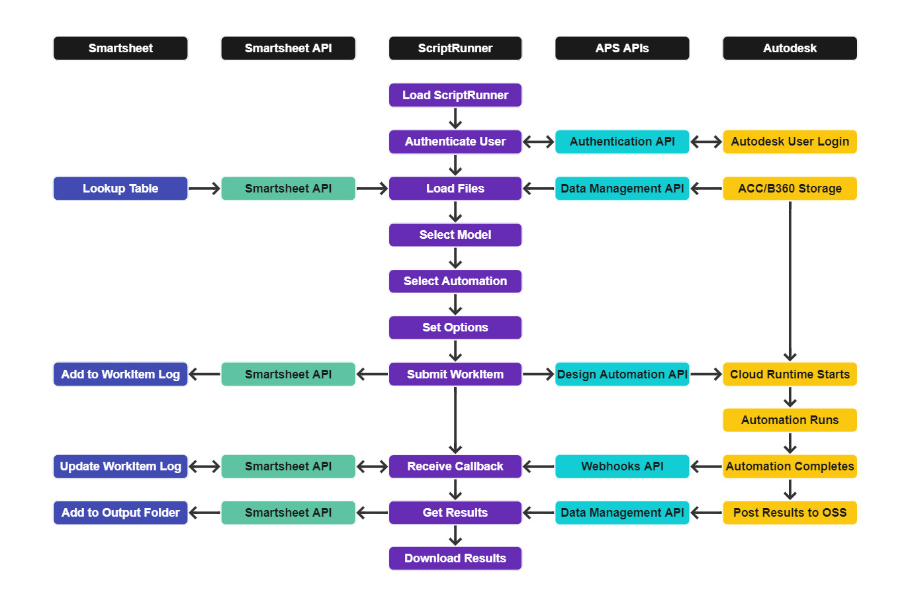

# DA4R-webapp "ScriptRunner"
Client-server application for running design automation scripts on Revit cloud models. Uses Autodesk Platform Services (APS) APIs including [Design Automation for Revit](https://aps.autodesk.com/en/docs/design-automation/v3/tutorials/revit/) (DA4R). Currently live at https://scriptrunner.wevrdmc.com/.

## Core Workflow Overview

## Core Packages and Dependencies

- [Node.js](https://nodejs.org/en/about) for server-side JavaScript runtime 
- [Express](https://expressjs.com/) web framework for Node.js
- [Axios](https://axios-http.com/docs/intro) HTTP client for Node.js
- [Socket.IO](https://socket.io/) for bidirectional client-server communication
- [CookieParser](https://www.npmjs.com/package/cookie-parser) for getting and setting client cookies
- [Luxon](https://moment.github.io/luxon/#/?id=luxon) for additional DateTime features
- [Smartsheet JavaScript SDK](https://github.com/smartsheet-platform/smartsheet-javascript-sdk) for Smartsheet API

## Configuring Automations

Design Automation AppBundles, Activities, and WorkItems are configured with the [Design Automation API](https://aps.autodesk.com/en/docs/design-automation/v3/reference/http/). A [Postman collection of HTTP requests](https://app.getpostman.com/join-team?invite_code=075d3cddf92262ce2934854c16cedba1&target_code=38187d83b39353ea03dba1bf0b4c035a) built by Blake Hageman is the toolkit of choice for updating and managing these configurations.

## Live Server

This app is currently running on Google Cloud servers, accessible at https://scriptrunner.wevrdmc.com/. The Google Cloud CLI is used to push new images to the live server with the command `gcloud run deploy --source .` when in the project directory.

## Data Storage

Smartsheet is used for persistent storage of [automation jobs](https://app.smartsheet.com/sheets/3xVGjvWJ6jHP4CWJrG8R9crgqmxHFhmc29HP6WJ1) and the [Revit:WEVR lookup table](https://app.smartsheet.com/sheets/CrpMWXR9HWjHvJpRJ92Hq88Q9HcfV3RmpHWjx9H1?view=grid&filterId=1747181111299972). The Smartsheet workspace also houses outputs from previously run automations.

## Usage Monitoring

### Autodesk Token Consumption

Autodesk's Data Management API is [a premium APS API](https://aps.autodesk.com/pricing-flex-tokens#:~:text=Info-,Design%20Automation%20API,-2.0) that uses prepaid tokens at a rate of 2 tokens/hour. Token consumption for this app can be viewed at https://aps.autodesk.com/myaccount/.

The app is owned and managed by Blake Hageman. Contact Blake to be added to this app as a collaborator.

### Google Cloud Server Logs

To monitor the live application server and view console output, go to the [Google Cloud Console](https://console.cloud.google.com/run/detail/us-central1/da4r-webapp/logs?authuser=4&project=wevr-dev).

### WorkItem Tracking

To view the status of a WorkItem, use the [GET workitems/{id} endpoint](https://aps.autodesk.com/en/docs/design-automation/v3/reference/http/workitems-id-GET/) in the project's [Postman collection](https://app.getpostman.com/join-team?invite_code=075d3cddf92262ce2934854c16cedba1&target_code=38187d83b39353ea03dba1bf0b4c035a). WorkItem IDs are logged in the [ScriptRunner WorkItem Log](https://app.smartsheet.com/sheets/3xVGjvWJ6jHP4CWJrG8R9crgqmxHFhmc29HP6WJ1) Smartsheet.

## Running Locally

1. Install node.js on your local machine and clone this repo
2. Check that the environment variable `IS_DEV` is set to `true` in the `.env` file.
3. Using Git Bash CLI:
    * navigate to repo folder
    * install all node packages with `npm install`
    * start app on http://localhost:3000 with `node app.js`. Port can be changed in `.env` file.
4. In another Bash window, start an ngrok tunnel to localhost with `./ngrok tunnel --label edge=edghts_2SnSjjSu1AgjArXXiUClNVHWSvq http://localhost:3000`
    * This edge is set up with Blake Hageman's ngrok free account; you might need to make your own account and set up your own edge. An ngrok edge is used here to provide a stable public callback URL when an automation completes; without this edge, automation results will not return to app. A new URL and associated callback routes must be registered with the APS app owned/managed by Blake Hageman at https://aps.autodesk.com/myapps/.
5. Go to https://tinyurl.com/BLOXscriptrunner (redirects to ngrok URL: https://globally-stirred-shiner.ngrok-free.app/)

## Code Sold Separately

Automations run by this app are stored in a separate **DA4R-automations** repository: https://github.com/blakehageman/DA4R-automations. These apps form the AppBundle code used in Design Automations.
